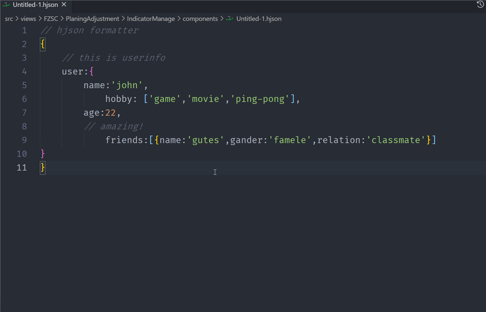

# hjson-formatter

[](https://marketplace.visualstudio.com/items?itemName=Tanh.hjson-formatter)
[](https://marketplace.visualstudio.com/items?itemName=Tanh.hjson-formatter)
[](https://marketplace.visualstudio.com/items?itemName=Tanh.hjson-formatter)

用于对.hjson文件的格式化



什么是[Hjson](https://hjson.github.io/)？

安装扩展后即可在hjson文件中使用格式化命令(默认命令为`shift+alt+f`)进行格式化。

> 推荐安装扩展[Hjson](https://marketplace.visualstudio.com/items?itemName=laktak.hjson)以获得更好的语言支持

## Customizations

支持定制化选项以决定你想要的格式, 遵循[hjson](https://www.npmjs.com/package/hjson)的api定义

* hjson-formatter.options
  * condense: integer, will try to fit objects/arrays onto one line. Default 0 (off).
  * bracesSameLine: boolean, makes braces appear on the same line as the key name. Default false.
  * emitRootBraces: boolean, show braces for the root object. Default true.
  * quotes: string, controls how strings are displayed. (setting separator implies "strings")
    * "min": no quotes whenever possible (default)
    * "keys": use quotes around keys
    * "strings": use quotes around string values
    * "all": use quotes around keys and string values
  * multiline: string, controls how multiline strings are displayed. (setting quotes implies "off")
    * "std": strings containing \n are shown in multiline format (default)
    * "no-tabs": like std but disallow tabs
    * "off": show in JSON format
  * separator: boolean, output a comma separator between elements. Default false
  * space: specifies the indentation of nested structures. If it is a number, it will specify the number of spaces to indent at each level. If it is a string (such as '\t' or ' '), it contains the characters used to indent at each level. if it is 'auto', will use current editor's indents
  * eol: specifies the EOL sequence. if it is 'auto', will use current editor's endOfLine
  * colors: boolean, output ascii color codes
  * serializeDeterministically: boolean, when serializing objects into hjson, order the keys based on their UTF-16 code units order. Default false.

### default options

settings.json

```json
    "hjson-formatter.options": {
        "separator": true,
        "condense": 4,
        "bracesSameLine": true,
        "quotes": "keys",
        "space": 2
    }
```

## Default Formatter

为了确保这个扩展比其他你可能已经安装的扩展优先使用，请在你的VS Code设置中将它设置为对应语言的默认格式化程序。

```json
{
  "[hjson]": {
    "editor.defaultFormatter": "Tanh.hjson-formatter"
  }
}
```

此扩展依赖[hjson](https://www.npmjs.com/package/hjson),感谢！